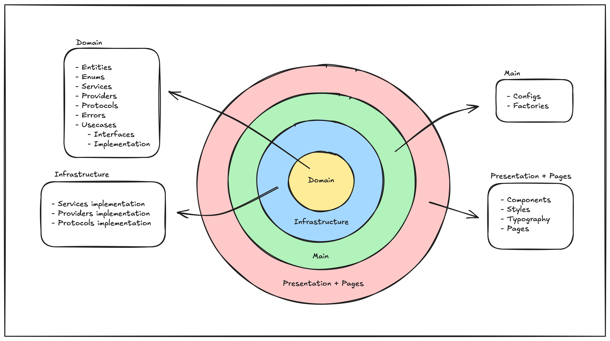

<h2 align="center">QUE FILME</h2>

  

  
  
  

  

  

 

 <b>Que Filme</b> aims to find the best movie and series suggestions for the user based on their previous choice of favorite titles. 🎥 🍿 ✨

 

## 🛠 Technologies

The tools below were used in the project's development:

- [Next.js 14](https://nextjs.org/)
- [TypeScript](https://www.typescriptlang.org/)
- [Toastify](https://fkhadra.github.io/react-toastify/introduction)
- [@emotion](https://emotion.sh/docs/introduction)
- [React Icons](https://react-icons.github.io/react-icons)
- [@svgr](https://react-svgr.com/docs/webpack/)
- [Axios](https://axios-http.com/docs/intro)
- [G4F](https://www.npmjs.com/package/g4f)
- [Testing Library](https://testing-library.com/docs/react-testing-library/example-intro/)
- [Jest](https://jestjs.io/docs/next/testing-frameworks)

## ⚙ Installation

1. Clone and set up this repository [Que Filme](https://github.com/werlleyg/quefilme)
2. Run `npm i` or `yarn` in the project folder on your computer
3. Run `npm run dev` or `yarn dev`
4. Your project is already running 🔭

 

## 🏗️ Infrastructure Diagram

The project is hosted at Vercel and is accessible by the user from any device with internet browsing. The project also uses integration with two service providers, one for movies and the other for AI.

## 🔗 Architecture Diagram

The project was built adapting clean arch concepts to the context of Next.js. It has its division into layers, which are below:

- **Domain:** Concentrates important information for business rules, such as entities, enums, errors, service, providers, protocols, and usecases contracts;

- **Infrastructure:** The implementation of service contracts, proviers and protocols is carried out;

- **Main:** In this layer, the factory pattern is carried out to instantiate the elements created in the infrastructure, in addition to aggregating project configurations such as environment variables and build settings;

- **Presentation + Pages:** Outermost layer of design, talking directly to the framework used, responsible for creating the components, typography and global stylizations. The Pages directory, responsible for concentrating the pages of the application, is separated by limitations of the framework itself in dealing with this resource. Consider Pages as part of Presentation.

 

## 🚀 CI/CD Flow

 
 

Developed by <a href="https://www.linkedin.com/in/werlleyg" target="_blank">Werlley Ponte</a>

---
